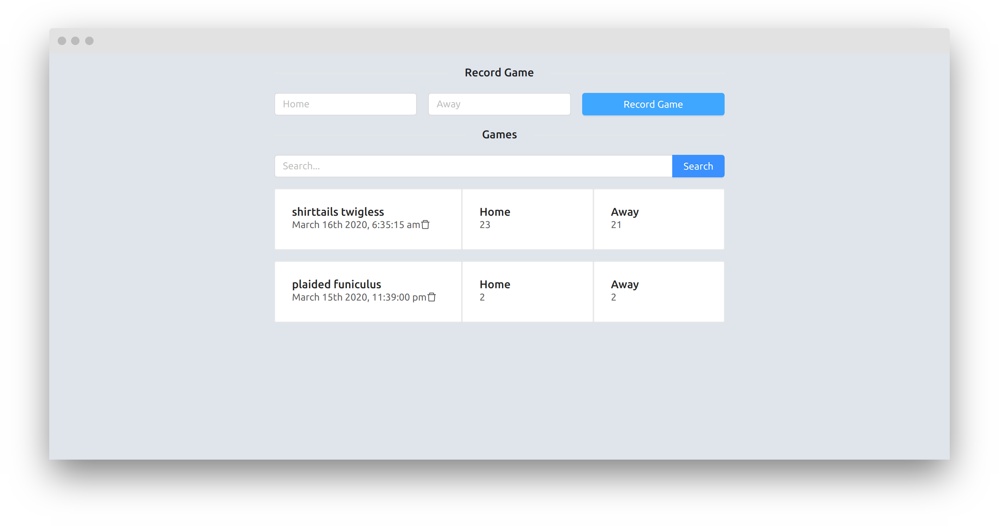

# Installation

In one shell start the backend with
```bash
docker-compose up
```

In another shell start the client with
```bash
cd front && yarn install
yarn start
```

# Testing

For testing the backend you will need to have Poetry
[installed](https://python-poetry.org/docs/#installation).

Run
```bash
poetry run python manage.py test
```

For testing the client run (from `./front`)
```bash
yarn test
```

The tests are meaningless. I did not have the time to write real tests.

This project was heavily informed by
[this](https://apirobot.me/posts/django-react-ts-how-to-create-and-consume-graphql-api)
article.

